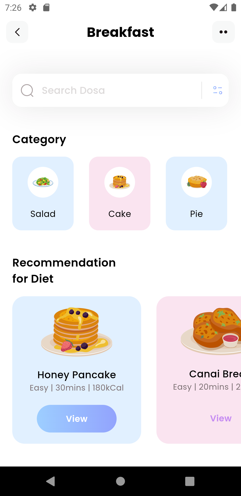
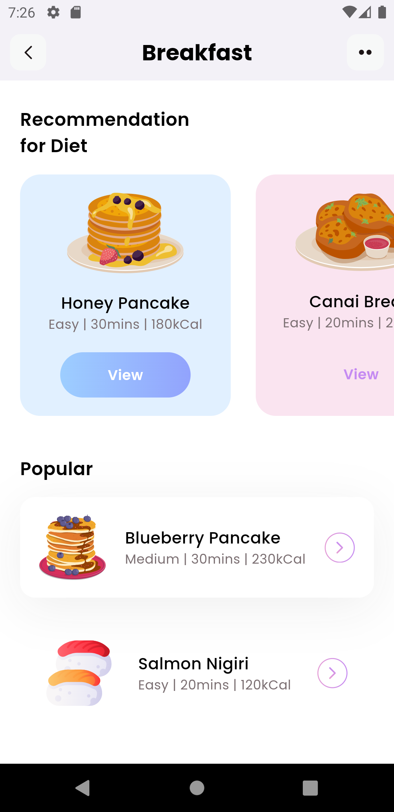

# Flutter Fitness App

## Introduction

Welcome to the Flutter Fitness App project! This mobile application is designed to help users maintain a healthy lifestyle by providing access to various fitness categories, diet recommendations, and popular workout routines. With an intuitive interface and engaging features, this app aims to make fitness accessible and enjoyable.

## Tech Stack

- **Flutter:** The UI toolkit for building natively compiled applications for mobile, web, and desktop from a single codebase.
- **Dart:** The programming language used to build Flutter applications.
- **Flutter SVG:** A Flutter package for rendering SVG files as Flutter widgets.
- **Material Design:** The visual language that synthesizes the classic principles of good design with the innovation and possibility of technology.

## Features

- **Category Section:** Explore different fitness categories with unique icons and names.
- **Search Functionality:** Find specific diets or workouts using the search bar.
- **Recommendation for Diet:** Get personalized diet recommendations based on your preferences.
- **Popular Workouts:** Discover popular workout routines with detailed information and icons.
- **Responsive Design:** The app is designed to provide a seamless experience across various screen sizes.

## Screenshots

_Home Page 1 of 2_

_Home Page 2 of 2_

## Code Overview

### `main.dart`

The `main.dart` file serves as the entry point for the application. It initializes the Flutter app, sets up the theme, and specifies the home page (`HomePage`) as the starting point for the app.

### `home.dart`

The `home.dart` file contains the implementation of the `HomePage` widget, which represents the main screen of the fitness app. Key functionalities include:

- **Initialization:** Fetches initial data for categories, diets, and popular workouts in the `_getInitialInfo` method.
- **User Interface:** Defines the structure of the home screen with sections for search, categories, recommended diets, and popular workouts.
- **Widgets:** Includes various helper methods such as `_searchField`, `_categoriesSection`, `_dietSection`, and `_popularSection` to modularize the code and enhance readability.
- **App Bar:** Configures the app bar with the app title and navigation icons.
